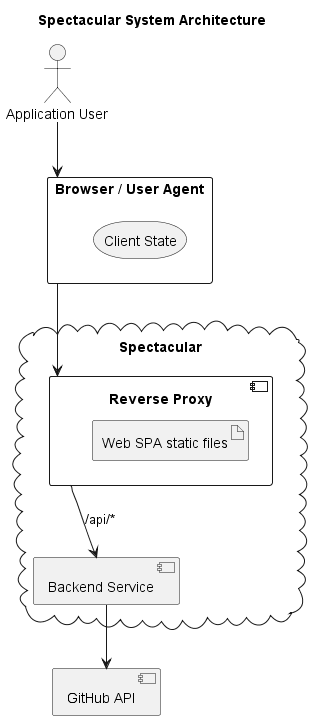

# System Architecture
The systems is built up of 2 separately deployable components:
- The [Web UI](#web-ui) frontend component that handles:
  - The bundling of the web UI single page application (SPA) files
  - And the serving of web requests to the web UI bundled files and backend services
- The [Backend Service](#backend-service) backend component that powers all of the Spectacular features and is invoked via a RESTful API

These 2 components can be seen in the Architecture diagram below:

## Web UI
Useful links for the `Web UI` component:
- The [web](../web) project folder contains 
  - the Single Page Web Application (SPA) source code files
  - web server configuration files
- Have a look at the project folder [README](../web/README.md) for further documentation

## Backend Service
Useful links for the `Backend Service` component:
- The [backend](../backend) project folder contains the application source code
- Have a look at the project folder [README](../backend/README.md) for further documentation
