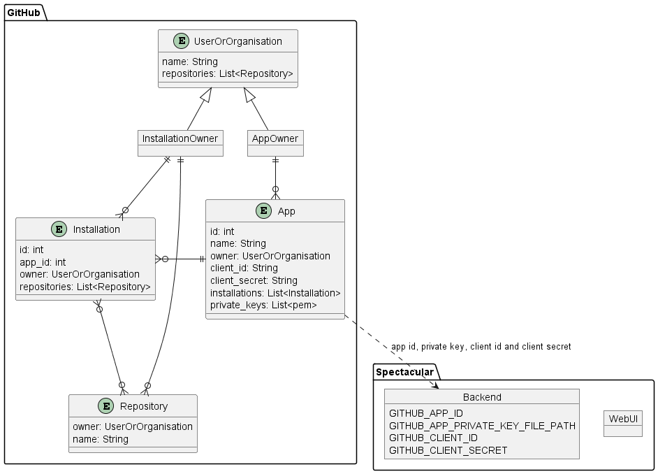

# Configuration
This document covers how to configure a new deployment of the Spectacular tool.

Be sure to familiarise yourself with the different components that form the Spectacular tool's [Architecture](architecture.md) and the [docker-compose.yml](../docker-compose.yml) file provided can also be used as a good reference.

You will need to complete the necessary [Git Integration](git-integration.md) setup steps before trying to configure your Spectacular deployment.

Document contents:
- [Configuration](#configuration)
  - [Git Integration Config](#git-integration-config)
    - [GitHub](#github)
  - [Single Sign On](#single-sign-on)
    - [GitHub SSO](#github-sso)
  - [JWT Shared Secret](#jwt-shared-secret)

## Git Integration Config
Spectacular is built around pulling information from OpenAPI files stored in git repositories, therefore you will need to configure your Spectacular instance to integrate with your git repository hosting solution.
The following Git hosting solutions are supported:
- [GitHub](#github)

### GitHub
After your GitHub App setup has been completed, the following configuration values need to be set for Spectacular to identify with GitHub as this new integration:
| Spectacular Component | Environment Variable Name | GitHub App Value |
| ----------------------| ------------------------- | ---------------- |
| Backend Service | `GITHUB_APP_ID` | The `App ID` found on your GitHub App's "General" page after completing the [Registering a new GitHub App](git-integration.md#registering-a-new-github-app) setup step |
| Backend Service | `GITHUB_APP_PRIVATE_KEY_FILE_PATH` | The file path to the location of a `.pem` Private Key file generated for your GitHub App in the [Generate Private Key](git-integration.md#generate-a-private-key) setup step |

The diagram below show how the Spectacular configuration items above map to the values of the GitHub App entities created in GitHub for the integration.

## Single Sign On
Spectacular relies on your Git Hosting solution to act as an `Identity Provider` and offer an OAuth2 / OpenID login workflow to be used as a Single Sign On (SSO) login option for the tool's users.

The following Git hosting solution SSO is supported:
- [GitHub SSO](#github-sso)

### GitHub SSO
After your GitHub App setup has been completed, the following configuration values need to be set for Spectacular to login users with their GitHub account.
| Spectacular Component | Environment Variable Name | GitHub App Value |
| ----------------------| ------------------------- | ---------------- |
| Backend Service | `GITHUB_CLIENT_ID` | The `Client ID` value found on your GitHub App's "General" page after completing the [Registering a new GitHub App](git-integration.md#registering-a-new-github-app) setup step. |
| Backend Service | `GITHUB_CLIENT_SECRET` | The `Client secret` value found on your GitHub App's "General" page after completing the [Registering a new GitHub App](git-integration.md#registering-a-new-github-app) setup step. |

## JWT Shared Secret
Spectacular uses JWTs to authorise requests to the backend REST API from the Web UI frontend application. A JWT is generated at the end of a successful user login process by the [Backend Service](architecture.md#backend-service). A "Shared Secret" is used by the Backend Service to sign the JWTs it generates and to verify the JWTs it receives back to prevent tampering.
| Spectacular Component | Environment Variable Name | Value |
| ----------------------| ------------------------- | ---------------- |
| Backend Service | `JWT_SHARED_SECRET` | A 32-byte text value. e.g. `this_test_shared_key_is_32_bytes` or `0c4ec70dbe9cceba51455c402b35d3a5`. It is important to set this value with something unique for each instance of Spectacular. Changing this value will invalidate all JWTs and user session, causing users to sign in again. |
