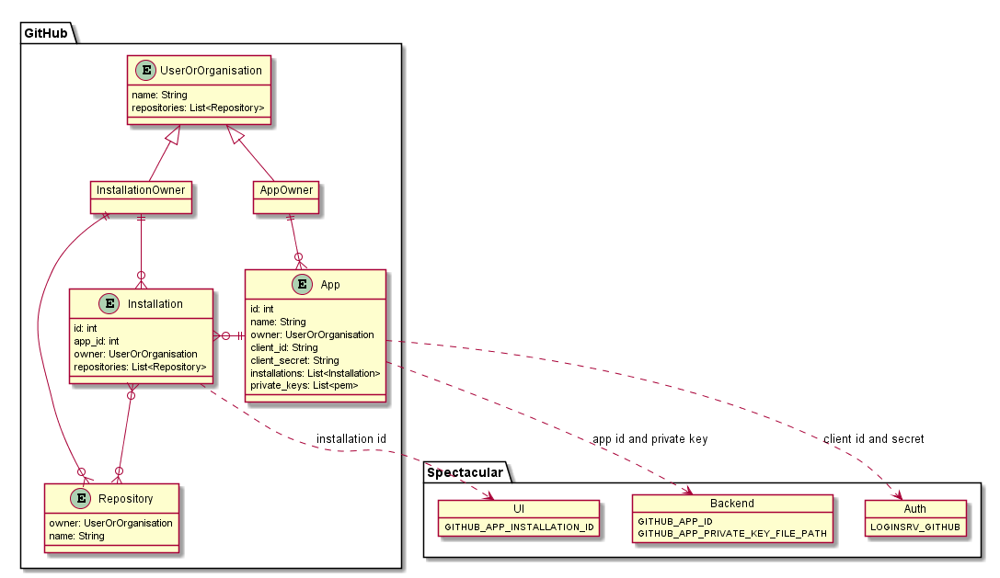

# Configuration
This document covers how to configure a new deployment of the Spectacular tool.

Spectacular is built around pulling information from OpenAPI files stored in git repositories, therefore you will need to configure your Spectacular instance to integrate with your git repository hosting solution.

So be sure to complete the necessary [Git Integration](git-integration.md) setup steps before trying to configure your Spectacular deployment.

The following Git hosting solutions are supported:
- [Configuration](#configuration)
  - [GitHub](#github)

## GitHub
After your GitHub App setup has been completed, the following key configuration values need to be set for Spectacular to identify with GitHub as this new integration:
| Spectacular Component | Environment Variable Name | GitHub App Value |
| ----------------------| ------------------------- | ---------------- |
| Backend Service | `GITHUB_APP_ID` | The `App ID` found on your GitHub App's "General" page after completing the [Registering a new GitHub App](git-integration.md#registering-a-new-github-app) setup step |
| Backend Service | `GITHUB_APP_PRIVATE_KEY_FILE_PATH` | The file path to the location of a `.pem` Private Key file generated for your GitHub App in the [Generate Private Key](git-integration.md#generate-a-private-key) setup step |
| Auth Service | `LOGINSRV_GITHUB` | A single string following the pattern `client_id=<Client ID>,client_secret=<Client secret>`. Where the `Client ID` and `Client secret` found on your GitHub App's "General" page after completing the [Registering a new GitHub App](git-integration.md#registering-a-new-github-app) setup step are substituted |
| Web UI | `GITHUB_APP_INSTALLATION_ID` | The ID of the installation of the GitHub App found in the URL after completing the [Allow access to your Repositories](git-integration.md#allow-access-to-your-repositories-create-an-app-installation) setup step |

The diagram below show how the Spectacular configuration items above map to the values of the GitHub App entities created in GitHub for the integration.

