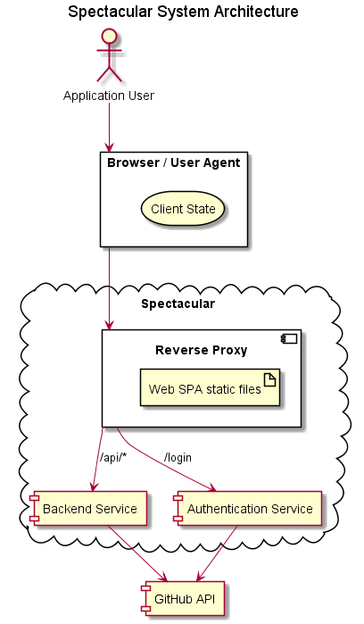

# System Architecture
The systems is built up of 3 core separately deployable components:
- A User Interface built as a Single Page Web Application
- Backend logic service exposed as a RESTful API
- User Login and Authentication service

In addition to these 3 core components the following infrastructure components are used:
- NGINX web server with the following responsibilities:
  - Serving the bundled Web UI static files
  - Acting as a reverse proxy and API gateway to the Backend and Authentication services

## Web UI
The [User Interface](../../web) for Spectacular is a Single Page Web Application (SPA) built using ReactJS.

This component is purposefully kept relatively "dumb" with exception of:
- the presentational logic required to drive the User Experience
- data fetching logic required to populate the visual components and application state
- logic to maintain the application state, such as authentication tokens

## Backend Service
The logic powering many of Spectacular's features is encapsulated in the [Backend](../../backend) service.
It exposes this logic to the Web UI using a RESTful API.

The following design decisions have been made:
- This service is to be kept stateless to allow for easy horizontal scaling. All state is to be keep in the client.

## User Authentication Service
The UI and logic for authenticating users using existing SSO providers, such as GitHub, is kept as a separate responsibility.
The "User Authentication" service used is an "off the shelf" OSS product called [loginsrv](https://github.com/tarent/loginsrv).
