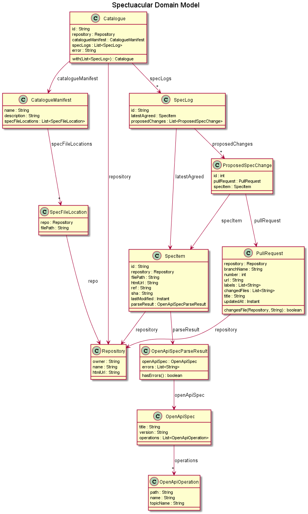

# Spectacular Domain Model
- [Spectacular Domain Model](#spectacular-domain-model)
  - [Domain Overview](#domain-overview)
  - [Domain Model](#domain-model)
    - [Repository](#repository)
    - [Catalogue](#catalogue)
    - [CatalogueManifest](#cataloguemanifest)
    - [SpecFileLocation](#specfilelocation)
    - [CatalogueManifest](#cataloguemanifest-1)
    - [SpecLog](#speclog)
    - [ProposedSpecChange](#proposedspecchange)
    - [PullRequest](#pullrequest)
    - [SpecItem](#specitem)
    - [OpenApiSpecParseResult](#openapispecparseresult)
    - [OpenApiSpec & OpenApiOperation](#openapispec--openapioperation)

## Domain Overview
Spectacular tries to solve the following problems:
- Organising interface specification files into different Catalogues
- Capturing all the different versions of an interface specification and categorising them against what current stage of an interface's evolutionary life cycle they are in

## Domain Model
The following domain model is Spectacular's attempt to model the problem space described above.

### Repository
Storing and tracking changes to interface specification files in git repositories is core component of how Spectacular works. The `Repository` object is used to represent a references to a specific git repository.

### Catalogue
The `Catalogue` object represents a collection of interface specifications.
It is uniquely identified by the repository the manifest file that describes this catalogue was found in.

A reference is kept to the [CatalogueManifest](#cataloguemanifest) object that was parsed to create the `Catalogue` instance, as well as any parsing error that were encountered.

For each interface specification in the catalogue a current snapshot of the different versions (or "evolution") of the interface specification are captured together as a [SpecLog](#speclog) item.

### CatalogueManifest
The `CatalogueManifest` object is used to capture the configuration values set by users to:
- Name and describe a Catalogue of related interfaces
- List out all the interfaces and the specification files that describe them. Each represented as a [SpecFileLocation](#specfilelocation) object.

### SpecFileLocation
The `SpecFileLocation` object is used within the `CatalogueManifest` to capture the configuration set by users to describe the following information needed to build a `SpecLog` representation of an interface:
- The location of where to find the interface specification file

### CatalogueManifest
The `CatalogueManifest` object is used to capture the configuration values set by users to:
- Name and describe a Catalogue of related interfaces
- List out all the interfaces and the specification files that describe them

### SpecLog
The `SpecLog` object attempts to represent a current snapshot of an interface's evolution. The different versions of the interface's specification file are taken from the VCS (git) history for the file and categories as follows:
- The "latest agreed" version is taken from the spec file's contents on the `master` branch
- Any "proposed changes" versions are taken from the spec file's contents on any branch that is currently requested to be merged into the `master` branch through an open Pull Request at present.

Each version of the spec file referenced is represented using a [SpecItem](#specitem) object, except for versions that are for "proposed changes" which are wrapped in a [ProposedSpecChange](#proposedspecchange) object.

### ProposedSpecChange
Proposed changes to an interface specification are an important part of the interface evolutionary life cycle. To facilitate the review, discussion and agreement to accept a proposal a "Pull Request" to merge changes into the `master` branch is used.

The `ProposedSpecChange` object is used to capture the details of a proposal using the following properties:
- A reference to an open [PullRequest](#pullrequest) object where the changes to the interface specification are being discussed and agreed upon.
- A reference to a [SpecItem](#specitem) object that captures the new proposed version of the specification file.

### PullRequest
The [PullRequest](#pullrequest) object captures useful details to display on the UI about the Pull Request (PR) used to propose changes to an interface specification, such as:
- The unique PR number
- The title of the PR
- The source branch the PR is trying to merge into the `master` branch
- Any labels that have been associated to the PR
- The URL link to the PR in the VCS hosting tool

### SpecItem
The `SpecItem` object represents a specific version of an interface specification file captured in git and the OpenAPI details described in its contents.

The specific version of the file can be uniquely identified as a combination of the following:
- The git repository and the file path to where the specification file can be found
- A friendly ref name (branch or tag) to the git commit this version of the file was taken at

The OpenAPI details described in the file's contents is captured as an [OpenApiSpecParseResult](#openapispecparseresult) object.

### OpenApiSpecParseResult
The `OpenApiSpecParseResult` object is created as a result of an attempt to parse/deserialize the content of an OpenAPI spec file. It encapsulates two key things:
- A reference to an [OpenApiSpec](#openapispec--openapioperation) object representing the parsed contents
- A list of any errors that were encountered while parsing the OpenAPI spec

### OpenApiSpec & OpenApiOperation
The `OpenApiSpec` & `OpenApiOperation` objects are used to capture specific values from the OpenAPI spec that are interesting to return with the `SpecItem` and display on the UI.
